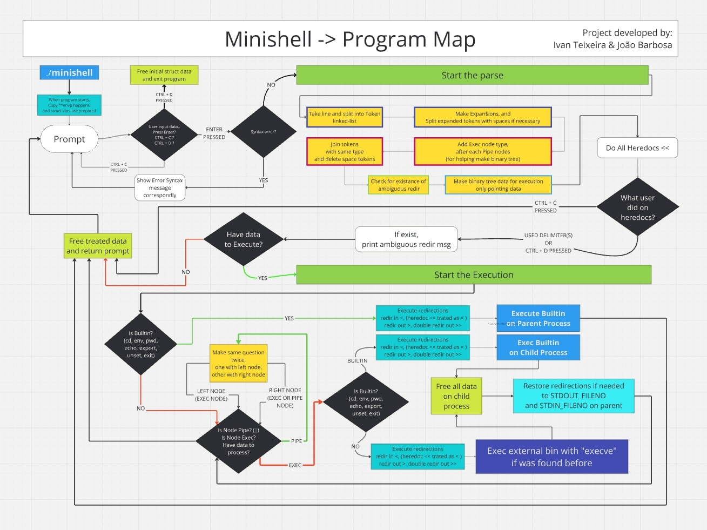

# ShellFault
## A simple replication of Bourne-Again Shell (Bash)

### This is a [42 School]() Project that aims to create a shell program in C as beautiful as Bash.

### Table of Contents

   1.[What's Shell?](# What's Shell?)
   2.[How to use](#How to use it?)
      2.1 [The Makefile](#The Makefile)
      2.2 [The Minishell itself](#The Minishell itself)
      2.2.1
### What's Shell?

Shell is a command-line program that lets you give instructions to the computer by typing text commands.
For example :
 - You can move files, rename or run them.
 - Check System status.

## How to use it?

### The Makefile

In this project we went beyond the simple make for building, but used Makefile to write some scripts to accelerate our development and debbugging cycle.

#### Note: Some rules need tmux to run (e.g:`gdb` and `vgdb`)

-  `make` Compiles the entire project and creates `minishell` binary;

- `make clean` Remove the object files `.o and .a`;

- `make fclean` Remove the object files and the binary;

- `make re` Rebuild the entire project.

- `make norm` Check if there is an error in Norminette

- `make gdb` Opens a new splitted window with `gdb` and `.gdbinit` file, this helps saving time in debuggind repetitive tasks.
   - Note: You need to config your gdb to accept and source the correct file. Check the [manual](https://man7.org/linux/man-pages/man5/gdbinit.5.html).

- `make vgdb` Opens a new splitted window with `valgrind` with gdb flag and `gdbtui` to attach the valgrind proccess to gdb.
   - Note: This tool is little known and there isn't a lot of information about. This helps to check where and more importantly WHEN the valgrind errors occurs, because it stops when there is an error and then you can inspect the state at the time of the error. More info [here](https://developers.redhat.com/articles/2021/11/01/debug-memory-errors-valgrind-and-gdb#using_valgrind_and_gdb_together).
   - Note: As far as I know, this tool doesn't support very well the multiprocess programs, because in gdb you are attaching to a single remote proccess. If you know more info about this topic please let us know!

- `make sync` Opens a new splitted window with `minishell` and `bash` side by side and with syncronization (hence the name) when typping, you write in one terminal, you write in both!

- `make va` Runs `minishell` with valgrind.

- `make tester` If the tester isn't in the same directory it clones and then run the tester (check [here](https://github.com/MrSloth-dev/minishell_tester))

- `make tester_va` Runs the tester with valgrind flag

### The Minishell itself

As stated in subject, minishell should:
   - Display a prompt when waiting for a new command;
   - Have a Working History;
   - Search and launch the right executable (based on PATH variable or using relative or an absolute path);
   - Handle ' (single quote) which should prevent the shell from interpreting the meta-characters in the quoted sequence;
   - Handle " (double quotes) which should prevent the shell from interpreting the meta-characters in the quoted sequence except for $ (dollar sign).
   - Implement redirections:
      - < should redirect input;
      - << should be given a delimiter, then read the input until a line containing the delimiter is seen (it's called heredoc);
      - > should redirect output;
      - > should redirect output in append mode;
   - Implement pipes ( '|' character). The output of each command in the pipeline is connected to the input of the next command via a pipe;
   - Handle environment variables ($ followed by a sequence of characters) which should expand to their values;
   - Handle $? which should expand to the exit status of the most recently executed foreground pipeline;
   - Handle ctrl-C, ctrl-D and ctrl-\ which should behave like in bash;
   - In interactive mode:
      - ctrl-C displays a new prompt on a new line;
      - ctrl-D exits the shell;
      - ctrl-\ does nothing;
    - Your shell must implement the following builtins:
      - echo with option -n;
      - cd with only a relative or absolute path;
      - pwd with no options;
      - export with no options;
      - unset with no options;
      - env with no options or arguments;
      - exit with no options;
What our minishell doesn't do:
   - Handle && and || with parentesis and priorities;
   - Wildcards;
   - Handle unclose quotes, simple or doble.
   - Sequencing Commands with ';'
   - Update History in heredoc;
   - Handle \ special character;
   - All other builtins not mentioned above;

## How does it Work?

In this chapter we explain step by step how we did it.
### The Program Map

