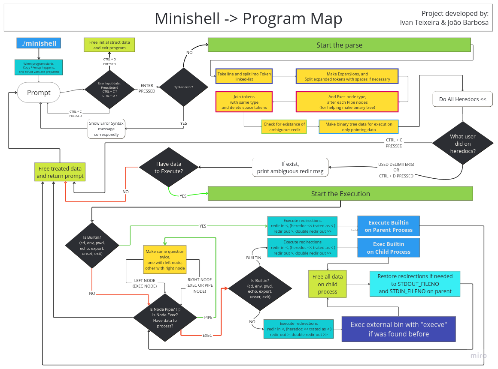

# ShellFault
## A simple replication of Bourne-Again Shell (Bash)

### This is a [42 School]() Project that aims to create a shell program in C as beautiful as Bash.

### Table of Contents

   1.[How to use](#How-to-use-it?)
      1. [The Makefile](#The-Makefile)
      2. [The Minishell itself](#The-Minishell-itself)
   2.[How does it Work?](#How-does-it-Work?)
      1. [The Program Map](#The-Program-Map)
      2. [Prompt](#Prompt)
      3. [Parser](#Parser)
      4. [Execution](#Execution)


## How to use it?

### The Makefile

In this project we went beyond the simple make for building, but used Makefile to write some scripts to accelerate our development and debbugging cycle.

| Command | Description |
|---------|-------------|
| `make` | Builds the project and creates the `minishell` binary |
| `make clean` | Removes object files (`.o` and `.a`) |
| `make fclean` | Removes object files and binary |
| `make re` | Rebuilds the entire project |
| `make norm` | Checks Norminette compliance |
| `make gdb` | Opens split window with GDB and `.gdbinit` |
| `make vgdb` | Opens split window with Valgrind+GDB interface |
| `make sync` | Opens split window comparing with Bash |
| `make va` | Runs with Valgrind |
| `make tester` | Runs test suite |
| `make tester_va` | Runs test suite with Valgrind |

 * Note: Some rules need tmux to run (e.g:`gdb` and `vgdb`)
 * Note about `make gdb`:You need to config your gdb to accept and source the correct file. Check the [manual](https://man7.org/linux/man-pages/man5/gdbinit.5.html).
 * Note about `make vgdb`:This tool is little known and there isn't a lot of information about. This helps to check where and more importantly WHEN the valgrind errors occurs, because it stops when there is an error and then you can inspect the state at the time of the error. More info [here](https://developers.redhat.com/articles/2021/11/01/debug-memory-errors-valgrind-and-gdb#using_valgrind_and_gdb_together).

### The Minishell itself

As stated in subject, minishell should:
   - Display a prompt when waiting for a new command;
   - Have a Working History;
   - Search and launch the right executable (based on PATH variable or using relative or an absolute path);
   - Handle `'` (single quote) which should prevent the shell from interpreting the meta-characters in the quoted sequence;
   - Handle `"` (double quotes) which should prevent the shell from interpreting the meta-characters in the quoted sequence except for $ (dollar sign).
   - Implement redirections:
      - `<` should redirect input;
      - `<<` should be given a delimiter, then read the input until a line containing the delimiter is seen (it's called heredoc);
      - `>` should redirect output;
      - `>` should redirect output in append mode;
   - Implement pipes ( `|` character). The output of each command in the pipeline is connected to the input of the next command via a pipe;
   - Handle environment variables (`$` followed by a sequence of characters) which should expand to their values;
   - Handle `$?` which should expand to the exit status of the most recently executed foreground pipeline;
   - Handle `ctrl-C`, `ctrl-D` and `ctrl-\` which should behave like in bash;
   - In interactive mode:
      - `ctrl-C` displays a new prompt on a new line;
      - `ctrl-D` exits the shell;
      - `ctrl-\` does nothing;
    - Your shell must implement the following builtins:
      - `echo` with option -n;
      - `cd` with only a relative or absolute path;
      - `pwd` with no options;
      - `export` with no options;
      - `unset` with no options;
      - `env` with no options or arguments;
      - `exit` with no options;
What our minishell doesn't do:
   - Handle `&&` and `||` with parentesis and priorities;
   - Wildcards;
   - Handle unclose quotes, simple or doble.
   - Sequencing Commands with `;`
   - Update History in heredoc;
   - Handle `\` special character;
   - All other builtins not mentioned above;

## How does it Work?

In this chapter we explore step by step how we did it.

### The Program Map



### Prompt
The first task is using the library [readline](https://www.man7.org/linux/man-pages/man3/readline.3.html) to make our program interactive.
[Prompt](assets/Prompt.png)
The argument that we pass to the function is the Prompt, it takes 3 parts:
   1. The USER that it will taken from the environment variable `$USER`
   2. The hostname that is on `/etc/hostname`
   3. The Current Workign Directory (cwd) with `$HOME` directory compression.

### Parser

This part is the most important and crucial in the entire project, a well done parser will give less headaches.
The main idea of the parser is taking sections and categorize them in types. They can be WORDS or SPACES(see [isspaces(3)](https://man.openbsd.org/isspace.3)), then we need to identify each word, if it's inside single or double quotes.

Because we did the execution via binary tree, it's important that we categorize the Tokens as Execution, Pipes or even redirections.

When doing the binary tree, the head of our tree needs to be a PIPE or EXEC if there isn't any pipe.
If there is any pipe, the right branch will be always try to point to the next pipe, if there isn't any pipe, the beggining of the next command will do.
The following image gives you a scheme of what we did in our parser step-by-step.
[Parser and Data Structures](assets/Parser_and_DataStructure.png)

Notice that in the Execution nodes we separated the tokens for it's type. If it's commands (or aguments) they'll go on the left, if they're redirections they'll go to the right, this way we assure that they won't mix-up during the execution.

### Execution
The execution will be done in two ways, depending on the way if need need to change or save the environment variables or not.

``` bash
# Updates $USER variable
joao-pol@Levelho:~/CommonCore/3.MiniShell$ export USER=isilva-t

# Won't update $USER variable
joao-pol@Levelho:~/CommonCore/3.MiniShell$ export USER=isilva-t | ls
```

Because of this, we need to run the command in the parent proccess, ONLY when it's a builtin, otherwise exceve will terminate our process.

Now we created a separated process to run our commands, either in a pipe or a simple not-builtin command.

Our execution in the binary tree is simplified because we have `recursion`. And to understand recursion, you need understand [recursion](https://www.youtube.com/watch?v=rf60MejMz3E)
In Recursion we walk out binary tree trying to find which type of node is it and the calls the same function until there isn't any node on the tree.

In the Pipe Nodes the premisse is simple :
   - Create a pipe between 2 file descriptors;
   - Fork the proccess to run the token to the left, redirecting the file descriptors into the pipe;
   - Fork the proccess to run the token to the right, redirecting the file descriptors into the pipe;
   - wait for both processes to end and retrieve their exit code.
   - Note that this approach works two proccesses at a time, so some peskies commands like `cat | cat | ls` won't hang up! When you make it working for 1 pipe, you made it working for all.

In the Execution Nodes the premisse is also simple:
   - Do the redirections, if there is any (only checking right branch);
   - If there is any problem with the redirections (e.g wrong permissions, not existent files) the execution will be skipped;
   - Check if command is a builtin and execute accordingly.

#### Note: Check the source code, because there are many nuances that I won't talk about because you need to find for yourself.


